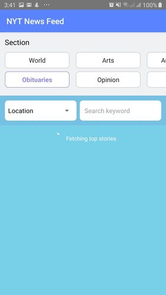

# React Native App + NY Times API
Coding assessment for a job application
  - Currently developed and tested for Android only.
  - iOS - no tools available.

## Screenshots
<p float="left">
  
  
  
  
  
</p>

## Features
  - Filter Top Stories by Section
  - Search articles based on location, keyword, and section filters
  - View article details
  - Offline support (Loaded data)

## API Used
  - Top Stories: https://developer.nytimes.com/docs/top-stories-product/1/overview
  - Article Search: https://developer.nytimes.com/docs/articlesearch-product/1/overview
  - Rest Countries: https://restcountries.eu/rest/v2/all
  
## Additional Info
  - React Native
  - Typescript
  - React Navigation
  - Styled Components
  - Eslint + Prettier
  - React Hooks (with custom hooks)
  - Redux Toolkit
  - Redux Persist (AsyncStorage)
  - React Native Offline
  - React Timeago 
  - Lodash
  - Unit Testing (Jest/Enzyme/)
  
## Newsfeed (Top Stories / Article Search) Logic
  - If **Section** is selected with no **Location** and **Keyword** value, the **Top Stories API** or saved data is triggered.
  - If **Section** is selected and either *Location** and **Keyword** value is set, the **Article Search API** is triggered.
  - If offline, only the previously cached/loaded data for each section is persisted on the application
  - To view the Top Stories data, **Location** field should be set to 'Location', and **Keyword** field should be empty.
  
## Local Setup
```bash
1. Clone the repository

2. Go to app directory
cd <project path>

3. Install packages
npm install

4. Run the application
npm run android     # Android
npm run ios         # IOS
```

## Folder Structure
```
project
└───android                                                 # Native Android files
└───ios                                                     # Native iOS files
└───src                                                     # Main application folder
│   └─── assets                                             # Application assets like images, etc
│   └─── components                                         # Components
│       └─── common                                         # Reusable components
│           └─── <component_folder>                         # Component directory
│               └─── index.tsx                              # Component definition
│               └─── styles.tsx                             # Styled components definition
│               └─── <component_folder>.test.tsx            # Test definition
│       └─── containers                                     # Application modules dcreens
│             └─── <Module>                                 # Parent module folder
│                   └─── <SubModule_folder>                 # Sub module folder
│                       └─── index.tsx                      # Sub module main component definition
│                       └─── <component>.tsx                # Sub module's child component definition
│                       └─── <SubModule_folder>.test.tsx    # Sub module's child component definition
│                   └─── index.tsx                          # Module main component (optional)
│   └─── config                                             # Configuration files
│   └─── constants                                          # Constants files like colors, size
│   └─── hooks                                              # Custom hooks files
│   └─── navigation                                         # App Navigation files
│          └─── AppNavigation.tsx                           # Main compiled navigation file
│          └─── AppRoutes.tsx                               # Route names definitions
│   └─── services                                           # Application services (Navigation, etc)
│   └─── styles                                             # Reusable styles
│   └─── store                                              # Redux related directory
│       └─── slices                                         # Module reducer files
│       └─── index.tsx                                      # Main redux store definition/compiler
│   └─── types                                              # Reusable type definitions
│   └─── utils                                              # Utils such as formatters, etc.
│   └────App.tsx                                            # Root application component
└───index.js                                                # Application registry file
```
